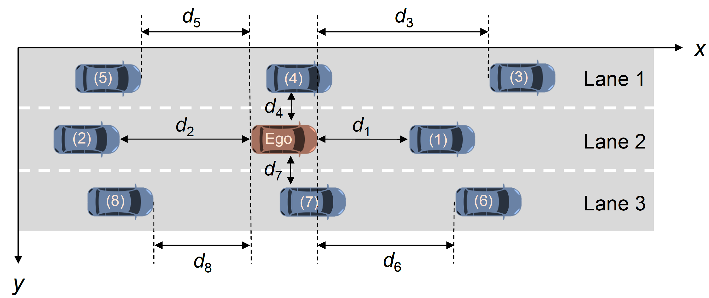
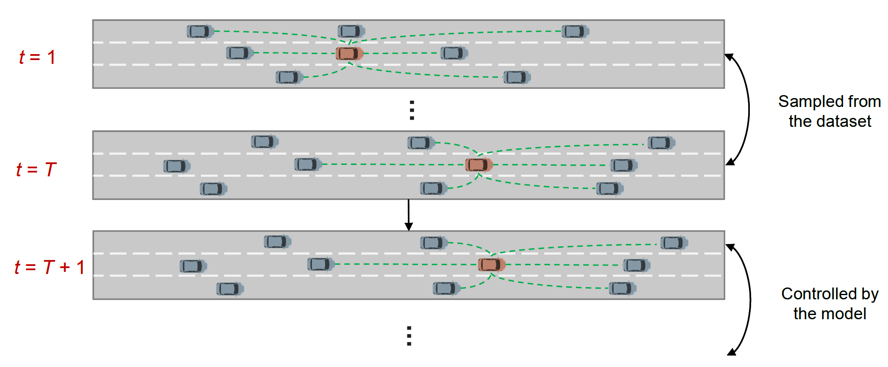

# Shifted Power Law

Unveiling Uniform Shifted Power Law in Stochastic Human and Autonomous Driving Behavior


# Preparation

**1. Create python environment**

```
conda create -n SPL python=3.10
conda activate SPL
pip install -r requirements.txt
```

**2. Download the training and simulation code**

```
# Download the simulator
mkdir shifted_power_law
cd shifted_power_law
git clone https://github.com/CATS-Lab/Shifted_Power_Law.git
```

**3. Download data**

You may download the [highD](https://www.highD-dataset.com), [CitySim](https://github.com/daibi/CitySim), and [AV datasets](https://github.com/CATS-Lab/Filed-Experiment-Data-ULTra-AV) for training or simulation.


# Training

<div align="center">
    <br>
    <strong>Illustration of the state for predicting the acceleration of the ego vehicle.</strong>
</div>


**Train the model to predict mean and standard deviation**

```
cd prediction
python train.py --loc_id 4
```


# Simulation

<div align="center">
    <br>
    <strong>Overview of the agent–based simulation framework.</strong>
</div>


**Run simulations and visualize the results**

```
cd simulation
python main.py --loc_id 4 --data_path ../data/07_tracks.csv --res_root results --vis True --num_sim 1 --dist power_law --init_frame_id 0 --max_frame_id 250
```

**Note:** If you do not assign *--init_frame_id* and *--max_frame_id*, the simulator will sample the initial frame id randomly and set the last frame id as the maximum frame id.
